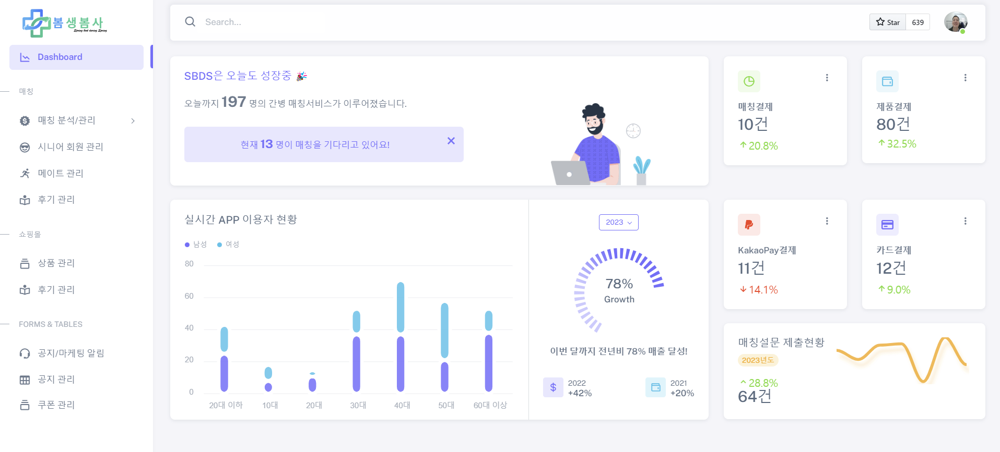
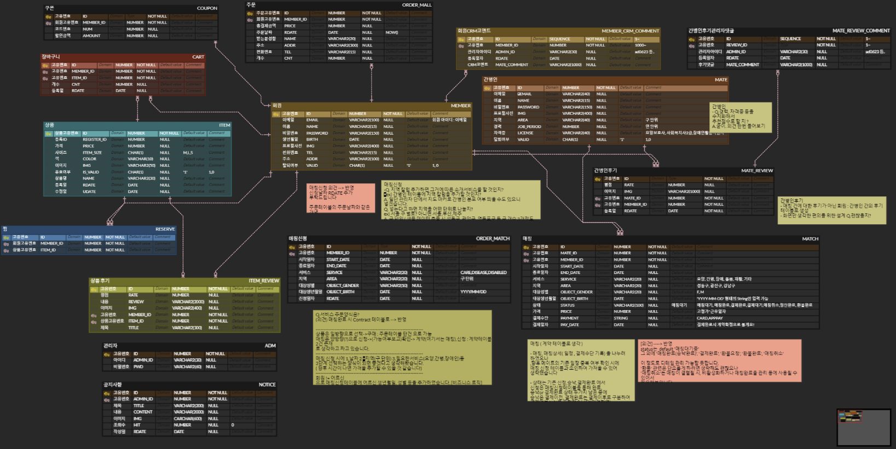
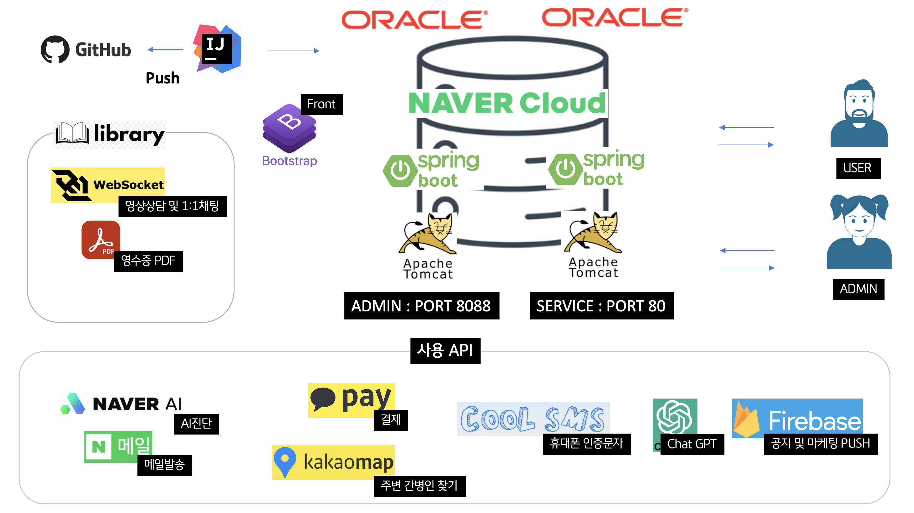
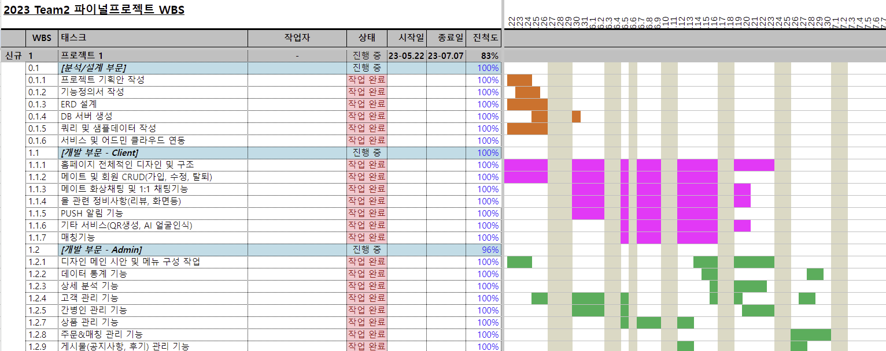

# SBDS-Admin 

💿[통합본 시연영상](https://drive.google.com/drive/folders/1QqyQvdCmkJ8ATxihtDx9ixJ-D3sclvau)  

 

 

# 0. 개발환경
1. Backend : MyBatis / Spring Boot
2. DB : Oracle
3. Frontend : JSP/CSS/BootStrap 6.x/Java Script/Jquery + ReactJS(옵션)
4. IDE : Intellij IDEA
5. 배포 : 네이버클라우드(또는 EC2)

# 1. 프로젝트 주제 및 기획의도
 ### 주제❗
    일반회원과 간병인의 매칭을 이어주는 Spring boot 기반 웹서비스의 관리자화면

 ### 기획의도 및 차별화❗️
  1. 관리자가 판매데이터로부터 통계화 된 매출차트를 가지고, 효율적이면서 편리하게 세일즈 & 마케팅 전략을 세울 수 있도록 도와주는 웹사이트 개발
  2. 관리자로 인해 Client단에서 노출 & 작동하는 많은 기능 및 결과치 컨트롤

  

# 2. 프로젝트 구조
### ✨프로젝트 ERD  

### ✨시스템 구성도

***  

 

**🔗[WBS 보러가기](https://drive.google.com/drive/folders/1RYPczjjoxkwLbOHh6t0E82PRswpJ7PMs)**  
  

***

# 3. 프로젝트 역할분담 👥

| 이름  | 역할                          |
|-----|-----------------------------| 
| 변다윗 | NCP 서버 전개 및 배포 Client 총괄 |  
| 권현진 | Admin 총괄                    |
| 박효선 | Client 기획, 기능, 디자인          |
| 신혜림 | 전체 기획 및 프리젠테이션              |
  

  

# 4. 프로젝트 핵심 기능 ✅

## 관리자 페이지 🧐
### 1) 실시간 통계 DashBoard
- 당일 시간대별 실시간 데이터와 누적 데이터 표시
- Jquery를 활용한 AJAX 통신, WebSocket을 활용. JS의 SET INTERVAL 함수, Schedule 함수 활용하여 실시간 통계 구현 
- 매칭 누적 건수, 매칭대기 건수
- 실시간 결제 현황 카드, 실시간 이용자 현황 차트

***

### 2) 매칭 상세 분석  : Analysis
- 매칭건수, 매칭금액, 매칭취소 건수, 매칭확정률, 결제완료 건수 카드 구현.
- 성별/연령별 매칭 현황 하이차트 구현
- 베스트 Mate TOP 10 테이블 구현

***

### 3) CRUD
1. 매칭 관리
- 성별, STATUS, 개시기간 Search 구현
- 페이지네이션 적용
- Ajax를 활용하여 상태버튼 클릭 시, 매칭완료->매칭취소 / 결제완료->정산완료 상태 변경 기능 구현

2. 시니어 회원 관리
- 이메일, 회원명, 생년월일 기간 Search 구현
- 페이지네이션 적용
- Ajax를 활용하여 상태버튼 클릭 시, 정지->활동->정지 상태 변경 기능 구현
- 회원별 Detail 화면 & Update 구현
- 회원 Detail 화면 구현기능 : 회원별 쿠폰 발행 페이지 연동, CRM 관리이력 등록/삭제, 회원 수정/삭제 구현

3. 메이트 관리
- 메이트명, 자격명, 지역명, 경력 기간별 Search 구현
- 페이지네이션 적용
- 평균평점 리스팅
- 메이트 신규 등록 구현
- 메이트 Detail 구현 : 정보수정, Ajax 활용한 회원 스탯 Progress-Bar, 최근 후기 5개 리스팅, Mate 삭제 구현

4. 메이트 후기 관리
- 메이트 명 검색 구현
- 페이지네이션 적용
- jQueary 활용한 체크박스 중복 삭제 구현
- 메이트 정보, 회원정보 연동
- 회원 후기 Detail : 후기 삭제, 관리자 댓글 기능 구현

5. 제품 관리
- 상품관리 : 제품 전체 테이블, 제품 신규 등록 구현
- 후기관리 : 후기 전체 테이블, 후기 체크박스 선택/삭제 기능 구현

6. 공지 관리
- 공지/이벤트 카테고리 분할 및 Search 구현
- 페이지네이션 구현
- 발행여부 버튼클릭 변경 구현
- 체크박스 선택/삭제 구현
- 공지 신규 등록 구현 : 첨부 이미지 랜더링, 공지 카테고리 선택 시 Input 칸에 해당 카테고리명 자동 적용 구현

7. 쿠폰 관리
- 쿠폰 발행 및 쿠폰 Search & 조회 한 화면에 구현
- 회원번호, 쿠폰코드, 할인금액 중복조건 Search 구현
- 쿠폰 발행 메세지 추가, Client 화면에서 고객에게 쿠폰 노출 시 안내 메세지 함께 발송되도록 Update
***

## 🎸기타

### 마케팅 PUSH
- Firebase를 연동하여 Client 화면 또는 앱 알림창에 실시간 PUSH알림 보내기 기능 구현

### 암호화(Bcrypt)
- Bcrypt 암호화를 통해 사용자의 비밀번호를 암호화하여 DB에 저장 : Adm Register, Mate Add
- 사용자가 입력한 비밀번호를 Bcrypt hash algorithm 적용 후 DB에 저장된 암호와 match하여 확인  
- Bcrypt hash algorithm 적용 시 임의의 salt를 생성하기 때문에 같은 입력값에 대해서 매번 다른 결과를 반환하여 강력한 보안 가능  

***
  
